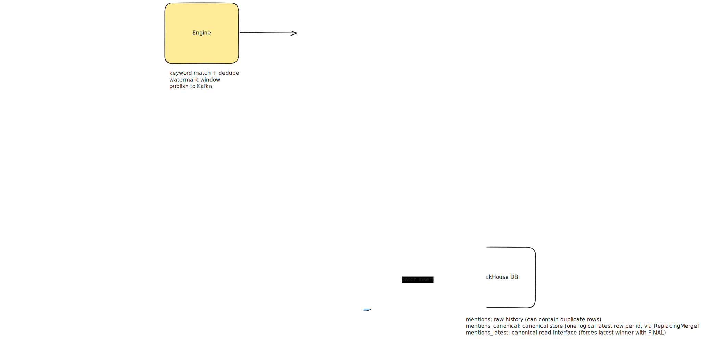

# o11yhn

**o11yhn** is a technical sandbox I’m developing to learn about [ClickHouse](https://clickhouse.com/) and experiment with [Dash0](https://www.dash0.com/).

The project pipelines data from the [Algolia Hacker News API](https://hn.algolia.com/api), fetching content related to observability topics, streaming it through Redpanda, into ClickHouse, and *soon* integrating [Kronk](https://www.kronkai.com/) for local, AI driven sentiment analysis.

This is an exploration project meant to run only locally, so tests will come later ;]

## What It Does

- polls Algolia Hacker News for observability keywords (`OpenTelemetry`, `eBPF`, `Prometheus`, etc.)
- cleans and enriches matched items into normalized `HNMention` events
- publishes events to Kafka (`hn-mentions`)
- consumes Kafka events and writes to ClickHouse
- maintains both raw and canonical deduplicated query surfaces
- emits traces for producer/consumer/storage activity to Dash0

## *NEXT*

Now that *o11yhn* is successfully piping observability-related HN mentions into ClickHouse, the focus shifts to "extracting signals" using a local AI.

I want to be able to ask the sandbox questions like:

*- "What are the current top-of-mind challenges for developers around observability?"*

*- "What is the overall developer perception of [Specific Tool]?"*

To handle both specific and abstract queries, the next phase involves implementing an Intent Classifier to route search requests based on the nature of the question:

**Keyword Routing (SQL)**: For terms like *"What do people think of Dash0?"*, the engine should prioritize direct keyword matches and metadata filters in ClickHouse.

**Semantic Routing (Vector)**: for conceptual questions like *"Typical observability challenges..."*, the engine should pivot to Vector Search to find mentions that are "close" in meaning, even if they don't share specific keywords.

Once this is done, I'll look into exposing this as a local AI assistant—likely served via a lightweight HTMX interface =]

## Architecture

<picture>
  <source media="(prefers-color-scheme: dark)" srcset="docs/arch-dark.svg">
  <source media="(prefers-color-scheme: light)" srcset="docs/arch.svg">
  
</picture>

1. `cmd/producer`
   - initialize telemetry
   - loads persisted watermark
   - polls HN with overlap window
   - deduplicates per run/window
   - publishes mentions to Kafka

2. `cmd/consumer`
   - initializes telemetry
   - ensures ClickHouse schema
   - polls Kafka with short timeout loop
   - buffers and flushes to ClickHouse

3. ClickHouse model
   - raw append-only table
   - canonical materialized table
   - stable deduped read view

## Data Flow

1. producer loads watermark from `.state/producer-watermark.json` (or uses `ENGINE_HISTORY_LOOKBACK` when state is missing).
2. producer fetches Algolia pages per keyword (`created_at_i > since-with-overlap`)
3. matching hits are normalized and published to Kafka topic `hn-mentions`
4. consumer reads Kafka records and inserts into raw table `mentions`
5. ClickHouse materialized view forwards rows to `mentions_canonical`
6. canonical reads are performed through `mentions_latest` (deduped view over canonical with `FINAL`)

## ClickHouse Objects

- `mentions`
  raw ingestion table (append-only; may include duplicates across retries/restarts)

- `mentions_to_canonical_mv`
  materialized view that copies rows from `mentions` into canonical storage

- `mentions_canonical`
  canonical table (`ReplacingMergeTree(ingested_at)`) keyed by `id`

- `mentions_latest`
  consumer-facing deduped view (`SELECT ... FROM mentions_canonical FINAL`)

### Query Guidance

- use `mentions_latest` for analytics and AI extraction
- use `mentions` for ingestion debugging and audit history.

## Local Setup

### 1) Configure env

Use `.env` (example in `.env.example`)

### 2) Start local infra

```bash
make db-up
```

### 3) Run pipeline

terminal 1:

```bash
make consumer
```

terminal 2:

```bash
make producer
```

### 4) Inspect data

```bash
make ch
```

Then:

```sql
SELECT count() FROM mentions;
SELECT count() FROM mentions_latest;
```
